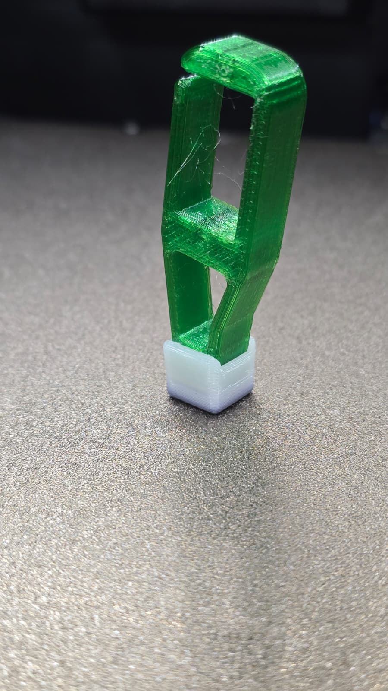
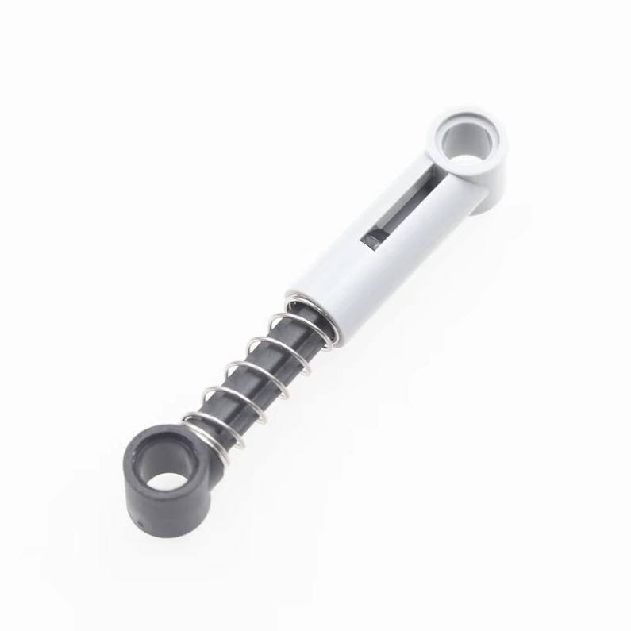
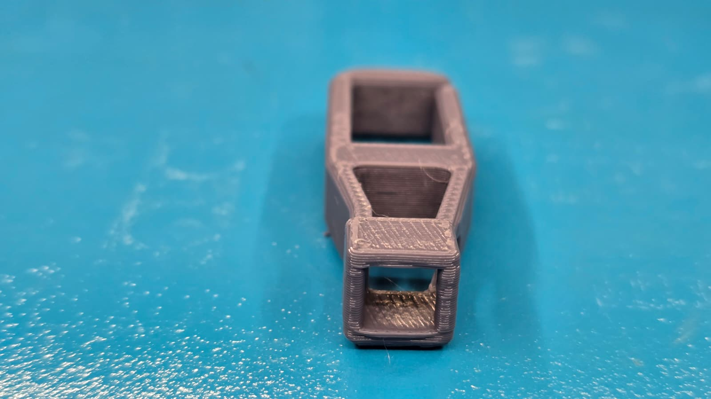
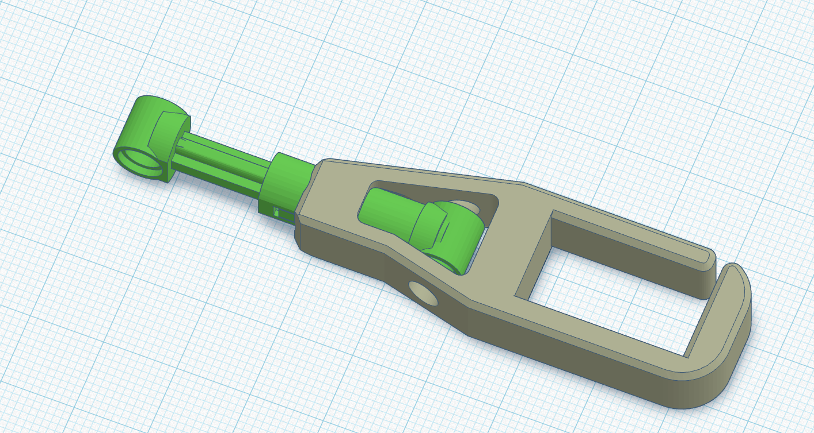
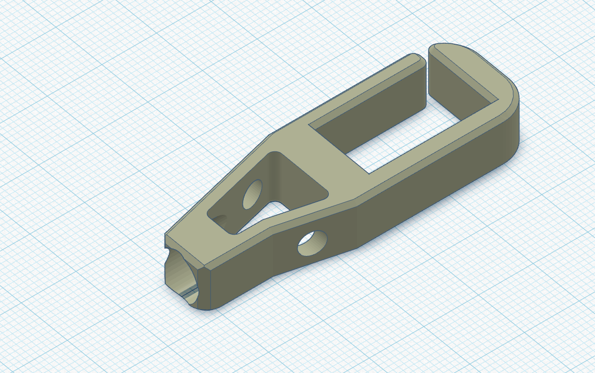

# The Sesame Robot Project 
___

  
  

___

**Greetings, from your new best friend.**

Sesame is an accessible Open-Source robotics project based on the ESP32 microcontroller system, with an emphasis on expression and movement. 
This project is designed for makers and engineers of all skill levels! Sesame offers a dynamic platform designed to start working with walking robots. 
To build a sesame robot, you will need basic soldering skills, $50-60 in hardware components, access to a 3D printer, and a basic understanding of Arduino IDE.

This repository contains the CAD design files, STL files, build and wiring guides, and the base/expanded firmware for the ESP32-based controller. 
There is also some included debugging firmware that may be helpful in getting your Sesame up and running.

## ⚡ Fork Notice: Leg & Foot Variations Specialist

**This is a specialized fork repository dedicated to developing and documenting different leg and foot variations for the Sesame robot.**

Explore alternative leg designs optimized for different locomotion characteristics and environmental conditions. All variations are 3D-printable and compatible with the standard Sesame platform. Find the STL files and assembly guides in `hardware/printing/`.

### Leg Variation Types

#### 1. Soft TPU Foot (Dampening)
A compliant, shock-absorbing foot design using flexible TPU material. Perfect for reducing impact forces and improving grip on smooth surfaces.

**Characteristics:**
- Excellent vibration dampening
- Enhanced grip on smooth surfaces
- Quieter operation
- Reduced stress on servo joints

#### 2. Shock Suspension with LEGO Integration
An advanced suspension system based on the LEGO 6.5L Soft Spring Grey component (Part #731c08). Provides spring-like shock absorption through mechanical linkage.

**Characteristics:**
- LEGO Part: 731c08 - 6.5L Soft Spring Grey
- Modular suspension design
- LEGO-compatible connectors
- Adjustable stiffness
- Superior obstacle traversal

#### 3. L4 Drilled Shock Harness (Experimental)
A modified version of the original L4 foot joint, drilled to accommodate the LEGO shock absorber spring. This design integrates the suspension directly into the foot structure.

**Characteristics:**
- Based on original L4 foot joint design
- Direct LEGO spring integration
- More compact form factor
- ⚠️ **Note:** Bottom section requires structural reinforcement - design refinement in progress

---

## Features

*   **Quadruped Design:** Uses 8 servo motors (2 per leg) to achieve roughly 8 total degrees of freedom.
*   **Emotive Display:** Features a 128x64 OLED screen acting as a reactive face that syncs with movement.
*   **Fully Printable:** Designed entirely for 3D printing in PLA with minimal supports.
*   **Network Connectivity:** Connect to your WiFi network for remote control and API access.
*   **ESP-NOW Wireless:** Optional ESP-NOW firmware for sub-5ms latency, peer-to-peer control without WiFi (requires second ESP32 board).
*   **JSON API:** RESTful API for programmatic control from Python, JavaScript, and more.
*   **Conversational Faces:** Expressive emotion library with talk variants for voice assistant projects.
*   **Sesame Studio:** New animation composer software to easily create custom movements.
*   **Sesame Companion App:** Python application for voice control and advanced interactions.
*   **Serial CLI:** Control the robot and trigger animations via a Serial Command Line Interface or the web UI.
*   **Pre-programmed Emotes:** Includes animations for Walking, Waving, Dancing, Pointing, Resting, and more.

## Watch the launch video on YouTube

___

## Getting Started

Follow these steps to build your own Sesame Robot:

### 1. Gather Parts 
Check the **[Bill of Materials (BOM)](hardware/bom/README.md)** for a complete list of required electronics and hardware.
*   Microcontroller: Lolin S2 Mini (recommended for DIY builds), Sesame Distro Board V2 (included in Build Kits, pre-flashed), or ESP32-DevKitC-32E with Distro Board V1 (legacy)
*   Actuators: 8x MG90 Servos
*   Power: 5V 3A source (USB-C PD for S2 Mini and V2 Distro Board, or battery + buck converter; see BOM for the 2× 10440 Li-ion + 2× AAA holder option)

### 2. Print Parts 
Download the STLs and follow the **[Printing Guide](hardware/printing/README.md)**.
*   Designed for PLA
*   Minimal supports required

### 3. Build & Wire 
Follow the **[Build Guide](docs/build-guide/README.md)** and **[Wiring Guide](docs/wiring-guide/README.md)** to assemble the frame and connect the electronics.

### 4. Flash Firmware 
Upload the code from the **[Firmware Directory](firmware/README.md)**.
*   Requires Arduino IDE
*   Configure WiFi AP settings

#### Optional: ESP-NOW Low-Latency Firmware
For sub-5ms control via USB serial (no WiFi needed), flash the ESP-NOW variant instead:
1. Flash **Robot** with `firmware/sesame-firmware-espnow.ino` (ESP32-S3)
2. Flash **Controller** with `software/esp-now/ESP32_C3_Sesame/ESP32_C3_Sesame.ino` (ESP32-C3 Mini, plugged into your computer)
3. Set robot MAC in controller via serial: `SET_ROBOT_MAC <robot_mac>`
4. Send `PING` to verify connection
*See [ESP-NOW docs](software/esp-now/ESP32_C3_Sesame/README.md) for full details.*

### 5. Create Animations 
Use **[Sesame Studio](software/sesame-studio/README.md)** to visually design poses and sequences for your robot.

---

## Software & Firmware

### Sesame Studio
Sesame Studio is a standalone desktop application included in `software/sesame-studio/`. It allows you to:
*   Visually pose the robot using a schematic interface.
*   Generate C++ code for servo angles automatically.
*   Sequence frames into complex animations.

[**> Go to Sesame Studio**](software/sesame-studio/README.md)

### Sesame Simulator
The Sesame Simulator, created by Jay Li, is a Rust-based 3D simulation environment for testing Sesame's movements and kinematics in a virtual space. It features:
*   **Physics-based Simulation:** Test walking and balance without hardware.
*   **Web-based Interface:** Run the simulator directly in your browser.
*   **URDF Integration:** Accurate modeling of Sesame's physical properties.

[**> Go to Sesame Simulator**](https://one-for-all.github.io/sesame-robot-sim/)

### Sesame Companion App
The Sesame Companion App is a Python-based application that enables advanced control and interaction with your robot over your local network. It leverages the new JSON API and network mode features to provide:
*   **Voice Assistant Integration:** Control Sesame with voice commands and see real-time emotional expressions.
*   **Remote Control:** Command your robot from anywhere on your local network.
*   **Face Control:** Change expressions dynamically based on conversation or context.
*   **API Examples:** Reference implementation for building your own integrations.

The Companion App works with robots running the latest firmware with network mode enabled.

[**> Go to Sesame Companion App Repository**](https://github.com/dorianborian/sesame-companion-app)

### ESP-NOW Firmware (Low-Latency Wireless)

An alternative firmware that replaces WiFi-based control with ESP-NOW radio protocol for sub-5ms latency and simpler setup (no access point needed). Controlled via USB serial from any computer or Raspberry Pi.

*   **Extremely low latency** — 1-5 ms round trip vs 20-100 ms over HTTP
*   **No WiFi router needed** — peer-to-peer ESP-NOW radio link
*   **Universal control** — Python, Node.js, shell scripts, or any serial terminal
*   **Bidirectional** — send commands and query status, trims, config
*   **Reserved for future sensors** — protocol includes MPU6050 data slots

**Hardware:** ESP32-S3 (robot) + ESP32-C3 Mini (USB bridge)

[**> Go to ESP-NOW Documentation**](software/esp-now/ESP32_C3_Sesame/README.md)

[**> Quick Debug Reference**](software/esp-now/DEBUG_CHECKS.md)

### Firmware
The ESP32 firmware (`sesame-firmware-main.ino`) handles the kinematics, face display, and WiFi control interface.
*   **Web UI:** Control the robot from your phone via the built-in Access Point.
*   **Custom Faces:** Add your own bitmaps (guide in firmware docs).

[**> Go to Firmware Docs**](firmware/README.md)

---

## Contributing

This robot is a platform for building new features, cosmetics, tools, and ideas. Since the current firmware is a basic implementation, pull requests are very welcome for:
*   Kinematics improvements
*   New animations
*   Improved Web UI/UX
*   Sensor integration (Ultrasonic, Gyro, etc.)

I would also love to see forks of this project with new hardware, software, faces, etc. Be sure to send me a message if you end up building one, and I might feature you on my website or channel!
  
---

## Sesame Complete Build Kit Pre-orders available!
I am excited to announce that, after popular demand, Sesame Complete Build Kits are now available for pre-order! 

That's right, your little robot companion just got even easier to build. Each kit includes all the components you need to build a full Sesame Robot. With the included detailed instructions, guides, and resources, this kit is perfect for both seasoned Makers and beginners. Click the image below to learn more.

---

## Credits

A special thanks to **Jason** for his invaluable contributions to 3D printing and design optimization. His expertise and dedication have greatly enhanced the quality and manufacturability of the Sesame robot platform.

---

*Created by [Dorian Todd](https://www.doriantodd.com/). Need help with your Sesame Robot? Send me a message on Discord, my username is "starphee"*
