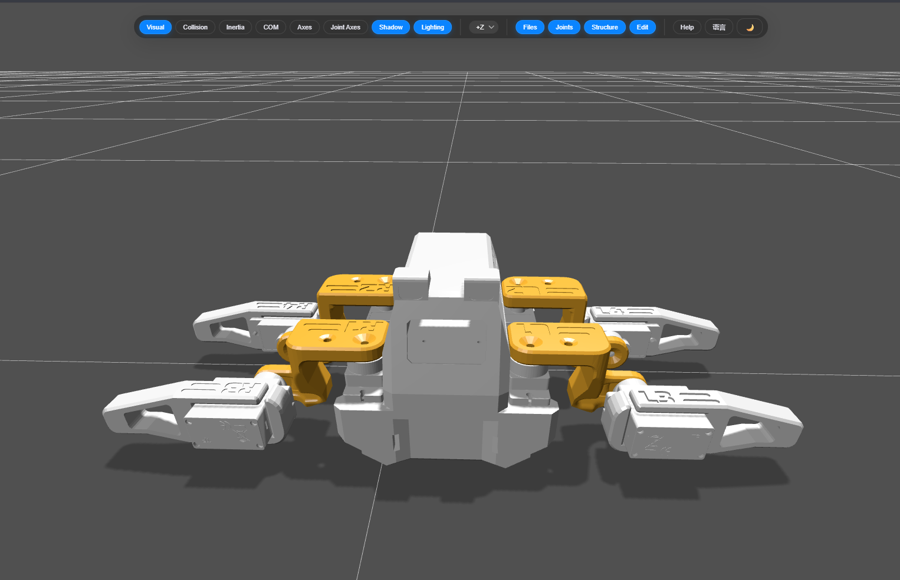

# sesameRL

RL training environment for the 4-legged, 8-DOF [Sesame quadruped,](https://github.com/dorianborian/sesame-robot/) built on [mjlab](https://mujocolab.github.io/mjlab/). PPO via `rsl_rl`, TensorBoard logging, and the [Sesame URDF](urdf_model/Sesame.urdf) loaded directly into a MuJoCo `MjSpec`.

Every observation, reward, event, curriculum stage, and PPO hyperparameter lives in the [config.py](config.py).

---

## Quick start

- Download the repository
- Create and activate a UV virtual environment:
  ```bash
  uv venv          # creates .venv directory
  source .venv/bin/activate  # on Windows: .venv\Scripts\activate
  ```
- Install mjlab (includes PyTorch and other dependencies):
  ```bash
  uv pip install git+https://github.com/mujocolab/mjlab.git
  ```
- From the base folder, with the virtual environment active:

```bash
python validate.py                                          # sinusoidal joint drive, no policy
python train.py                                             # full PPO run
python play.py                                              # auto-loads latest checkpoint
python play.py --checkpoint-file logs/<run>/model_<n>.pt    # play a specific checkpoint
tensorboard --logdir logs                                   # monitor training
```

---

## Layout

```
sesameRL/
├── validate.py        sanity check
├── config.py          all the configs, main place to edit
├── train.py           run for training
├── play.py            run for sandbox play
├── sesame_robot.py    imports robot from URDF file
├── env_cfg.py         composes mjlab environment from config.py
├── urdf_model/        Sesame.urdf + STL meshes
├── images/            visualization assets
└── logs/              rsl_rl run dirs (TensorBoard + checkpoints + params snapshots)
```

## Visualization

The `images/` directory contains visualizations of the robot and training results.



---

## Robot notes

Link / joint naming inherited from the Sesame project:

| Link    | Role         | Hip joint | Knee joint |
|---------|--------------|-----------|------------|
| Link_L3 | Front-left   | Joint_L1  | Joint_L3   |
| Link_L4 | Rear-left    | Joint_L2  | Joint_L4   |
| Link_R3 | Front-right  | Joint_R1  | Joint_R3   |
| Link_R4 | Rear-right   | Joint_R2  | Joint_R4   |

---

## Roadmap

- [ ] URDF checks
	- [ ] Solidworks->URDF is not very mature, so some positions/axes might be off
	- [X] Starting orientation is garbage visually. Has no adverse effect, but would be nice if it was standing straight.
- [ ] Check the [TODO] and [OPT] tags in [config.py](config.py)
    - [ ] Tune kp-kd values
    - [ ] Make the NN small enough to fit ESP32
    - [ ] Current observations are not realizable with existing hardware
    - [ ] Currently uses curriculum, can upgrade to hierarchical learning
    - [ ] Play with rewards for better locomotion
- [ ] Terrain is flat, can upgrade to a rough terrain
- [ ] Sim-to-real preparation (needs extended hardware)

## Credits
Original concept and skeleton code from @karabibik